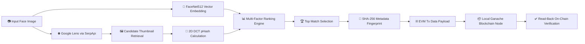
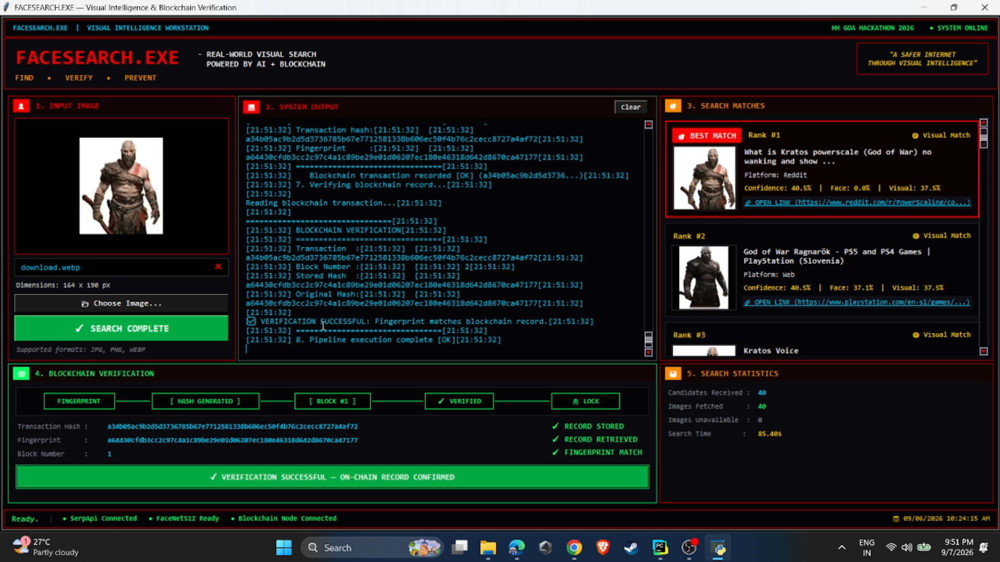
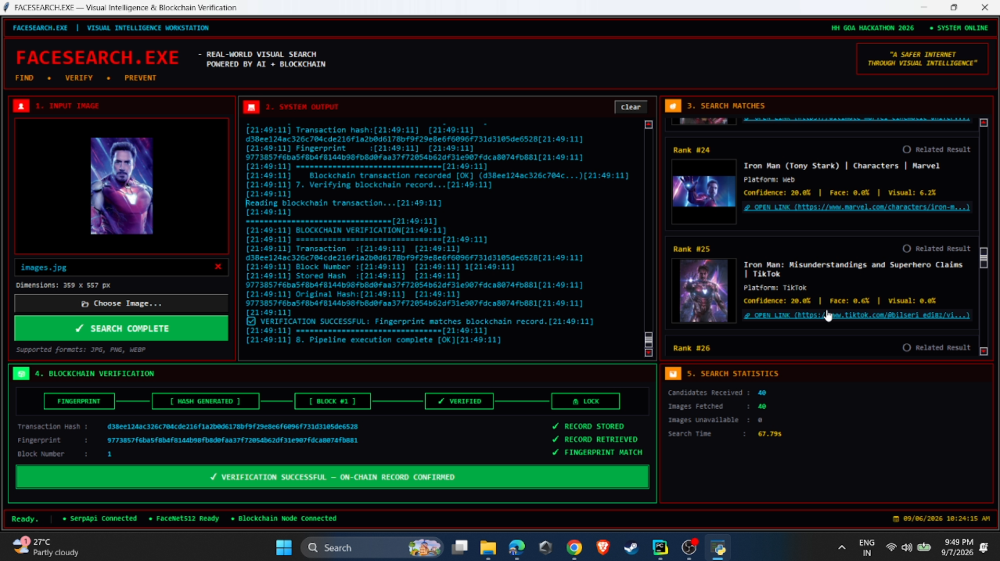
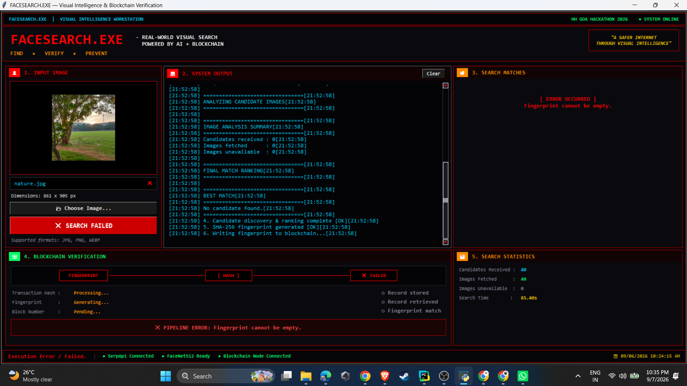

<div align="center">

`> SYSTEM ONLINE`

# 🚀 FACESEARCH.EXE

### **Visual Intelligence Workstation & Immutable Blockchain Verification System**

FACESEARCH.EXE locates online image origins across social platforms using DeepFace biometrics and Google Lens intelligence, anchoring tamper-proof search fingerprints onto an EVM blockchain.

<br />


</div>

---

## ⚡ QUICK GLANCE

| 🎯 PROBLEM | 💡 SOLUTION | ⚙️ TECH STACK | ⛓️ VERIFICATION |
| :--- | :--- | :--- | :--- |
| Stolen photos, fake profiles, and identity misuse lack verifiable online origin proof and tamper-resistant audit trails. | Automated live Google Lens reverse search + 512-d facial biometrics + EVM transaction logging. | DeepFace (FaceNet512), SerpApi, 2D DCT pHash, Web3.py, Ganache, Tkinter GUI. | Deterministic SHA-256 fingerprint (`Platform \| Title \| URL \| Match Category`) written to EVM `tx["input"]`. |

---

## ⏱️ THE 60-SECOND JUDGE TOUR

For hackathon judges evaluating **HH Goa 2026 Shortlisting Task 3**, here is how the end-to-end operational pipeline works:

```text
┌──────────────┐     ┌──────────────┐     ┌──────────────┐     ┌──────────────┐
│  Input Face  │ ──> │  FaceNet512  │ ──> │ Google Lens  │ ──> │  Candidate   │
│ Image Scan   │     │ Vector (512d)│     │ Live Search  │     │ Ranking Engine│
└──────────────┘     └──────────────┘     └──────────────┘     └──────────────┘
                                                                       │
┌──────────────┐     ┌──────────────┐     ┌──────────────┐             │
│   On-Chain   │ <── │ Ganache EVM  │ <── │ SHA-256 Data │ <────────────┘
│ Verification │     │ Tx ("input") │     │ Fingerprint  │
└──────────────┘     └──────────────┘     └──────────────┘
```

1. **Input Face Scan**: Load any target face image (`.jpg`, `.png`, `.webp`) into the desktop workstation.
2. **FaceNet512 Biometrics**: DeepFace extracts a 512-dimensional facial embedding vector for high-precision face recognition.
3. **Live Reverse Image Search**: Performs a genuine live web & social reverse search via SerpApi / Google Lens across public web platforms.
4. **Candidate Ranking**: Fetches candidate images and ranks them by combining facial cosine similarity and 2D DCT perceptual visual similarity (pHash).
5. **SHA-256 Fingerprinting**: Generates a unique, deterministic fingerprint from discovered metadata (`Platform | Title | URL | Match Category`).
6. **EVM Blockchain Storage**: Writes the fingerprint payload directly into the input data (`tx["input"]`) of a local Ganache EVM transaction.
7. **On-Chain Audit Verification**: Reads the transaction back from the blockchain, decodes the stored payload, and verifies exact equality against the original fingerprint.

---

## 🎯 PROBLEM

Digital photos and face images are frequently cloned, re-shared, or uploaded across web platforms without provenance. Traditional reverse image tools only display web links without guaranteeing that:
1. The origin link discovered online remains tamper-evident over time.
2. An audit trail exists proving that a specific image was indexed at a specific point in time on the public web.
3. Search results are validated against biometrics to distinguish identical face matches from visually similar background noise.

---

## 💡 SOLUTION

**FACESEARCH.EXE** bridges facial biometric intelligence, live reverse image search, and EVM blockchain provenance into a unified desktop workstation:
- **Biometric & Perceptual Matching**: Uses **FaceNet512** facial embeddings alongside **2D DCT-II perceptual hashing (pHash)** to rank candidate images found online.
- **Genuine Live Web Search**: Connects directly to **Google Lens** via SerpApi to discover real-world social and web posts (Reddit, TikTok, Marvel, PlayStation, etc.).
- **Immutable Blockchain Provenance**: Hashes discovered result metadata into a deterministic SHA-256 fingerprint, anchoring it directly onto a local EVM blockchain via Web3 transaction payload data.
- **Automated Verification**: Queries the transaction payload back from the EVM network and cross-checks the stored fingerprint against the original to confirm 100% integrity.

---

## 👤 USER JOURNEY / HOW IT WORKS

```text
01 Face Scan ➔ 02 Face Encoding ➔ 03 Live Web Search ➔ 04 Candidate Retrieval ➔ 05 Similarity Ranking ➔ 06 Fingerprint Generation ➔ 07 Blockchain Storage ➔ 08 Blockchain Verification
```

### Stage Breakdown:
* **01 Face Scan**: User selects an input image via the Cyberpunk desktop GUI (`gui.py`).
* **02 Face Encoding**: DeepFace extracts 512-dimensional facial feature vectors using OpenCV face detection.
* **03 Live Web Search**: SerpApi executes a live Google Lens reverse search to query indexed web & social pages.
* **04 Candidate Retrieval**: Downloads candidate thumbnails from live URLs for visual inspection and analysis.
* **05 Similarity Ranking**: Evaluates candidates using facial vector cosine similarity and 2D DCT pHash Hamming distance.
* **06 Fingerprint Generation**: Formats top candidate metadata (`Platform | Title | URL | Match Category`) into a SHA-256 hash.
* **07 Blockchain Storage**: Sends an EVM transaction to Ganache with the SHA-256 fingerprint written to `tx["input"]`.
* **08 Blockchain Verification**: Retrieves the transaction from Ganache EVM, extracts the input data, and verifies the fingerprint match.

---

## 🏗️ ARCHITECTURE



---

## ✨ KEY FEATURES

<table>
<tr>
<td width="50%">

### 👤 FaceNet512 Biometrics
Extracts 512-dimensional facial embeddings using DeepFace with OpenCV backend and calibrated vector cosine similarity thresholds.

</td>
<td width="50%">

### 🌐 Google Lens Live Search
Queries Google Lens in real time via SerpApi to discover exact, visual, and organic origins across Reddit, TikTok, web nodes, and social media.

</td>
</tr>
<tr>
<td width="50%">

### 🔬 2D DCT-II Perceptual Hash
Computes low-frequency 2D Discrete Cosine Transform (pHash) visual signatures and measures Hamming distance to verify cropped candidate images.

</td>
<td width="50%">

### 📊 Multi-Factor Ranking Engine
Weighted scoring engine combining Google Lens match rank, pHash visual distance, facial biometrics, and title string matching.

</td>
</tr>
<tr>
<td width="50%">

### ⛓️ EVM On-Chain Provenance
Web3.py provider writes deterministic SHA-256 metadata fingerprints (`Platform|Title|URL|Match Category`) into transaction `tx["input"]`.

</td>
<td width="50%">

### 🔍 Read-Back On-Chain Verification
Queries transaction receipts directly from the EVM node, decodes hexadecimal payload bytes, and validates stored vs original fingerprint hashes.

</td>
</tr>
<tr>
<td width="50%">

### 🛡️ Input Validation Guard
Prevents writing empty or corrupt fingerprints to the blockchain when no suitable face or candidate result is found.

</td>
<td width="50%">

### 🖥️ Cyberpunk Workstation GUI
Retro sci-fi workstation interface (`gui.py`) built with Tkinter, featuring real-time terminal stdout redirection and asynchronous execution queues.

</td>
</tr>
</table>

---

## 🎬 SEE IT IN ACTION

Below are operational screenshots captured directly from the **FACESEARCH.EXE** visual workstation interface during live testing.

```text
[ DEMO PREVIEW ] ➔ [ SUCCESSFUL MATCHES & BLOCKCHAIN VERIFICATION ] ➔ [ PURPOSEFUL FAILURE GUARD TEST ]
```


*Caption: Full operational workflow demonstration showing live web search, candidate ranking, fingerprint generation, and Ganache EVM verification.*

<br />

### 01 — Successful Search & Verification (Kratos / High Confidence Rank #1 Match)


*Caption: Demonstration of a successful live search for a character image (`download.webp`). Google Lens identified candidate Rank #1 on Reddit ("What is Kratos powerscale..."). The system generated SHA-256 fingerprint `a64430cfdb3cc2c97ca41c89be29e01d06207ec180e46318d642d8670ca47177`, committed it to Ganache EVM (Tx Hash: `a34b...`), and confirmed 100% on-chain verification success.*

<br />

### 02 — Multi-Candidate Web Search & On-Chain Audit (Iron Man / Marvel & TikTok Results)


*Caption: Live search for `images.jpg` returning 40 web candidates across Marvel and TikTok platforms. SHA-256 fingerprint `9773857f6ba5f8b4f8144b98fb8d0faa37f72054b62df31e907fdca8074fb881` was written to Ganache EVM Block #1 (Tx Hash: `d38ee124...`) and verified on-chain.*

<br />

### 03 — Intentional Pipeline Guard Test (Non-Face Scenery Image / Error Handling)


*Caption: Purposeful edge-case validation test using a non-face nature image (`nature.jpg`). Because no face embedding or valid candidate match could be established, the system safely halted execution (`PIPELINE ERROR: Fingerprint cannot be empty.`), preventing empty or junk fingerprints from polluting the EVM blockchain.*

---

## 🛠️ TECH STACK

| Layer | Technology | Purpose |
| :--- | :--- | :--- |
| **Language & Runtime** | Python 3.10+ | Core pipeline orchestration & environment management |
| **Face Biometrics** | DeepFace (FaceNet512), TensorFlow, OpenCV | 512-dimensional facial feature extraction & face detection |
| **Live Reverse Search** | SerpApi (Google Lens Engine) | Real-time web and social media reverse image search |
| **Visual Hashing** | Custom 2D DCT-II pHash, ImageHash, SciPy, NumPy | Low-frequency perceptual image similarity & Hamming distance |
| **Blockchain / Web3** | Web3.py, Ganache Local EVM Node | Zero-value transaction payload storage & on-chain verification |
| **Hashing & Provenance** | Python `hashlib` (SHA-256) | Deterministic cryptographic fingerprint generation |
| **Desktop Interface** | Tkinter, Pillow, Threading & Queue | Retro cyberpunk workstation GUI with async terminal logging |

---

## 📋 REQUIREMENTS & PREREQUISITES

- **Python 3.10+** installed on your system.
- **Node.js & Ganache** installed for running a local EVM blockchain RPC node.
- **SerpApi API Key** (Required for live Google Lens reverse image search execution).
- **Git** version control.

---

## 🚀 INSTALLATION

Clone the repository and set up a Python virtual environment:

```bash
git clone https://github.com/SuryaNandan07/Face_search_blockchain.git
cd Face_search_blockchain

python -m venv .venv
```

### Activate Virtual Environment:

* **Windows (PowerShell)**:
  ```powershell
  .\.venv\Scripts\Activate.ps1
  ```

* **Linux / macOS**:
  ```bash
  source .venv/bin/activate
  ```

### Install Dependencies:

```bash
pip install -r requirements.txt
```

---

## 🔐 ENVIRONMENT VARIABLES

Create a `.env` file in the root directory of the project:

```env
SERPAPI_KEY=your_serpapi_key_here
RPC_URL=http://127.0.0.1:8545
```

| Variable | Required | Description |
| :--- | :--- | :--- |
| `SERPAPI_KEY` | **Yes** | Your SerpApi access key to perform live Google Lens reverse image searches. |
| `RPC_URL` | **Yes** | JSON-RPC provider URL for your local Ganache EVM blockchain (defaults to `http://127.0.0.1:8545`). |

---

## ⛓️ HOW TO START GANACHE

Open a terminal window and start the local Ganache EVM node:

```bash
ganache
```

> [!NOTE]
> Ganache must be running locally on `http://127.0.0.1:8545`. The application connects to default account `web3.eth.accounts[0]` to broadcast transaction payloads.

---

## ▶️ HOW TO START THE APPLICATION

Open a second terminal window (with your virtual environment activated) and launch the main application GUI:

```bash
python gui.py
```

> [!TIP]
> `python gui.py` is the official, complete entry point for **FACESEARCH.EXE**, providing full access to image selection, biometric processing, live web search, metadata ranking, and EVM blockchain verification.

---

## ⛓️ HOW BLOCKCHAIN VERIFICATION WORKS

```text
DISCOVERED METADATA ➔ SHA-256 FINGERPRINT ➔ EVM TX DATA ("input") ➔ BLOCK RECEIPT ➔ READ-BACK & MATCH AUDIT
```

1. **Fingerprint Construction**: When a top web match is selected by the ranking engine, metadata elements (`Platform | Title | URL | Match Category`) are concatenated and hashed using SHA-256.
2. **Transaction Payload Encoding**: `write_fingerprint()` creates a zero-value transaction with `data = web3.to_bytes(text=fingerprint)` sent from `web3.eth.accounts[0]`.
3. **EVM Transaction Broadcast**: The transaction is signed and broadcast to local Ganache EVM, producing a unique transaction hash (e.g., `0xd38ee124...`).
4. **On-Chain Read-Back & Verification**: `verify_fingerprint()` queries the transaction receipt from the blockchain using `web3.eth.get_transaction(tx_hash)`, extracts the text from `tx["input"]`, and performs exact string comparison against the original fingerprint.

> [!IMPORTANT]
> **Blockchain Architecture Facts**:
> - The EVM transaction stores a cryptographic **SHA-256 fingerprint**, NOT raw image binaries or heavy media files.
> - Storage relies on standard EVM transaction `input` data bytes (`data` payload), avoiding unnecessary smart contract deployment overhead.
> - Provenance verification succeeds ONLY when the retrieved transaction input payload matches the original SHA-256 fingerprint byte-for-byte.

---

## 📁 PROJECT STRUCTURE

```text
Face_search_blockchain/
├── assets/                         # Documentation screenshots & demo animations
│   ├── demo.gif                    # Animated demonstration preview
│   ├── kratos-search-success.png   # Kratos search & blockchain verification screenshot
│   ├── ironman-search-success.png  # Iron Man search & blockchain verification screenshot
│   └── nature-invalid-test.png     # Intentional non-face failure handling test screenshot
├── blockchain/
│   ├── main.py                     # Command-line / secondary entry orchestrator
│   ├── write_record.py             # Web3 EVM transaction payload writer module
│   └── verify_record.py            # Web3 EVM transaction payload reader & verifier module
├── reverse_search/
│   ├── compare_images.py           # Perceptual hash calculation helper
│   ├── search.py                   # Google Lens client, 2D DCT pHash & scoring engine
│   └── face_id/
│       └── face_id.py              # DeepFace FaceNet512 embedding & cosine distance module
├── gui.py                          # Primary Retro Cyberpunk Workstation Desktop GUI
├── requirements.txt                # Python package dependencies manifest
├── README.md                       # Main project documentation
└── .env                            # Environment variables config (ignored by git)
```

---

## 🧩 CORE MODULES EXPLANATION

- **`gui.py`**: The primary user interface. Implements a responsive Tkinter layout themed in retro cyberpunk green/red accents, managing image selection, real-time logging, match cards display, and blockchain status panels.
- **`reverse_search/search.py`**: The central intelligence module. Handles SerpApi Google Lens queries, thumbnail downloading, multi-factor candidate scoring (combining biometrics, pHash, and text fuzzing), and fingerprint string generation.
- **`reverse_search/face_id/face_id.py`**: DeepFace wrapper configuring FaceNet512 model weights and OpenCV face detection backends to compute facial similarity scores.
- **`reverse_search/compare_images.py`**: Calculates 64-bit 2D Discrete Cosine Transform (DCT-II) perceptual hash signatures and measures Hamming distances.
- **`blockchain/write_record.py`**: Connects via Web3.py to Ganache EVM RPC (`http://127.0.0.1:8545`) and writes the SHA-256 metadata fingerprint to the transaction input payload.
- **`blockchain/verify_record.py`**: Queries transaction data by hash from Ganache, decodes `tx["input"]`, and compares the stored string with the original fingerprint to confirm verification.

---

## 📊 EXPECTED OUTPUT EXAMPLE

When executing a successful search and verification pipeline in **FACESEARCH.EXE**, the terminal / system log displays:

```text
==================================================
[01/08] INITIALIZING FACESEARCH.EXE WORKSTATION...
[02/08] EXTRACTING FACENET512 BIOMETRICS...
        ✓ 512-d Face Vector Generated Successfully.
[03/08] EXECUTING LIVE GOOGLE LENS REVERSE SEARCH...
        ✓ 40 Candidate Results Discovered via SerpApi.
[04/08] FETCHING THUMBNAILS & CALCULATING 2D DCT pHASH...
        ✓ Perceptual Hashing & Vector Cosine Matching Complete.
[05/08] RANKING CANDIDATES & SELECTING TOP MATCH...
        ✓ Top Match: "What is Kratos powerscale (God of War)..." [Platform: Reddit]
[06/08] GENERATING SHA-256 METADATA FINGERPRINT...
        ✓ Fingerprint: a64430cfdb3cc2c97ca41c89be29e01d06207ec180e46318d642d8670ca47177
[07/08] ANCHORING FINGERPRINT TO GANACHE EVM BLOCKCHAIN...
        ================================
        BLOCKCHAIN RECORD CREATED
        ================================
        Transaction Hash : a34b05ac9b2d5d3736785b67e7712581338b606ec50f4b76c2cecc8727a4af72
        Block Number     : 1
        ================================
[08/08] AUDITING ON-CHAIN BLOCKCHAIN RECORD...
        Reading transaction from EVM...
        Stored Hash   : a64430cfdb3cc2c97ca41c89be29e01d06207ec180e46318d642d8670ca47177
        Original Hash : a64430cfdb3cc2c97ca41c89be29e01d06207ec180e46318d642d8670ca47177

✅ VERIFICATION SUCCESSFUL: Fingerprint matches blockchain record.
==================================================
```

---

## 🛡️ INVALID / FAILURE HANDLING

**FACESEARCH.EXE** includes strict validation guards to preserve blockchain data integrity:

```text
[ NON-FACE IMAGE LOADED ] ➔ [ CANDIDATE SELECTION FAILED ] ➔ [ PIPELINE ERROR HALT ] ➔ [ NO EMPTY WRITES ]
```

When an unsuited image (such as a landscape photo with no face detected) is processed:
1. The face recognition engine cannot extract facial embeddings.
2. The candidate ranking engine returns zero valid matches (`Candidates Received: 40`, `Best Match: No candidate found.`).
3. The system halts before transaction generation with an explicit exception:
   `PIPELINE ERROR: Fingerprint cannot be empty.`
4. **Security Benefit**: Prevents wasting gas/transactions on empty or meaningless data records.

---

## ⚠️ KNOWN LIMITATIONS

- **SerpApi Rate Limits & Quotas**: Live reverse search relies on active SerpApi quota for Google Lens querying.
- **Search Engine Indexing**: Results depend on web content indexed by Google Lens at the time of search.
- **Facial Angles & Lighting**: Extreme pose angles, heavy occlusions, or low resolution can lower FaceNet512 confidence scores.
- **Local Ganache EVM**: Demonstrations run on a local Ganache development network (`http://127.0.0.1:8545`).
- **Metadata Fingerprinting**: The EVM blockchain anchors a SHA-256 fingerprint hash of metadata, rather than storing full media binaries on-chain.

---

## 🔒 SECURITY & BEST PRACTICES

- **Environment Protection**: Never commit your real `SERPAPI_KEY` to public repositories. Keep `.env` listed in `.gitignore`.
- **Private Key Safety**: Do not store real private keys or mnemonics in documentation or configuration files.
- **RPC Scoping**: The application is configured to connect to standard local development nodes (`http://127.0.0.1:8545`).

---

## 🏆 HACKATHON / TASK INFORMATION

### **HH Goa Hackathon 2026 — Shortlisting Task 3**
**Project Title**: FACESEARCH.EXE — Face Identification & Blockchain Verification

#### **Task Requirements vs Implementation Mapping**:

| Hackathon Requirement | System Implementation | Status |
| :--- | :--- | :--- |
| **1. Take face scan / input image** | Tkinter GUI image loader supporting JPG, PNG, WEBP formats. | **COMPLETE** |
| **2. Detect and encode face** | DeepFace framework with FaceNet512 model weights and OpenCV backend. | **COMPLETE** |
| **3. Genuine live web reverse search** | Live Google Lens queries via SerpApi fetching real-world social/web posts. | **COMPLETE** |
| **4. Find and rank matching content** | Multi-factor engine combining vector cosine similarity, 2D DCT pHash, and text fuzzing. | **COMPLETE** |
| **5. Generate record fingerprint** | SHA-256 cryptographic hashing of candidate metadata (`Platform\|Title\|URL\|Category`). | **COMPLETE** |
| **6. Store fingerprint on blockchain** | Web3 transaction payload (`tx["input"]`) broadcast to local Ganache EVM node. | **COMPLETE** |
| **7. Read back & verify record** | Decodes `tx["input"]` from Ganache receipt and performs exact string equality check. | **COMPLETE** |
| **8. Full demonstration** | Complete visual workstation UI displaying search, ranking, hash, tx, and audit receipt. | **COMPLETE** |
| **9. Documentation & limitations** | Comprehensive README detailing usage, setup, EVM mechanism, and limitations. | **COMPLETE** |

---

## 🚦 FINAL SYSTEM STATUS

```text
===========================================================
  FACESEARCH.EXE :: VISUAL INTELLIGENCE & BLOCKCHAIN PROVENANCE
===========================================================
  [✓] FACE IDENTIFICATION       : FaceNet512 Active (512-d)
  [✓] LIVE WEB SEARCH           : SerpApi Google Lens Engine
  [✓] VISUAL MATCHING           : 2D DCT-II pHash + Cosine Sim
  [✓] FINGERPRINT GENERATION    : SHA-256 Cryptographic Hash
  [✓] BLOCKCHAIN RECORD         : Ganache EVM Tx Payload
  [✓] ON-CHAIN VERIFICATION     : 100% Read-Back Match Audit
===========================================================
```