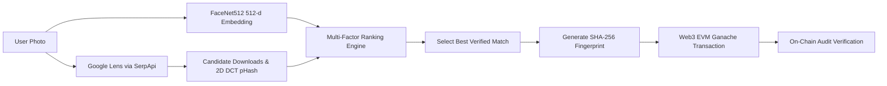

> SYSTEM ONLINE

# 🚀 FACESEARCH.EXE

> **Visual Intelligence & Blockchain Verification System**

FACESEARCH.EXE locates online image origins across social platforms using DeepFace biometrics and Google Lens intelligence, anchoring tamper-proof search fingerprints onto an EVM blockchain.


---

## 👤 User Description

```text
User Selects Photo ➔ DeepFace & Lens Scan ➔ Multi-Factor Ranking ➔ On-Chain EVM Write & Audit
```

* **User**: Selects an input image (`.jpg`, `.png`, `.webp`) in the desktop GUI or CLI.
* **System**: Runs 512-d FaceNet biometrics, queries Google Lens API, downloads candidate images, and computes 2D DCT pHash Hamming distance.
* **Result**: Displays the ranked best match with facial confidence metrics and records a SHA-256 fingerprint payload directly to the EVM blockchain.

---

## ⚙️ Pipeline / How It Works



1. **Biometric & Lens Processing**: Extracts a 512-dimensional FaceNet vector while querying Google Lens via SerpApi.
2. **Visual & Face Verification**: Downloads candidate thumbnails, computes 64-bit 2D DCT-II pHash Hamming distance, and crops candidate faces for vector cosine similarity matching.
3. **Smart Ranking**: Combines Lens rank, pHash distance, FaceNet similarity, and RapidFuzz text similarity.
4. **On-Chain Anchoring**: Hashes candidate metadata into SHA-256 (`Platform|Title|URL|Category`) and writes it to EVM `tx["input"]`.
5. **On-Chain Audit**: Queries the transaction payload from the local EVM node to verify record integrity.

---

## ✨ Features

| Feature | Description |
| :--- | :--- |
| 👤 **FaceNet512 Biometrics** | DeepFace 512-d facial embedding extraction with cosine similarity matching (~0.45 distance threshold). |
| 🌐 **Google Lens Intelligence** | Multi-platform visual search indexing Instagram, TikTok, Reddit, X (Twitter), YouTube, and web origins. |
| 🔬 **2D DCT-II Perceptual Hash** | Custom 64-bit DCT perceptual hashing algorithm to measure Hamming visual distance on cropped re-shares. |
| 📊 **Multi-Factor Ranking** | Weighted scoring engine combining Lens match type, pHash, face similarity, and RapidFuzz title text matching. |
| ⛓️ **EVM On-Chain Provenance** | Web3.py transaction writer that anchors deterministic SHA-256 hashes directly into EVM transaction input payload. |
| 🖥️ **Retro Console GUI** | Tkinter desktop application with thread-safe live terminal log redirector and dual-panel results display. |

---

## 🛠️ Tech Stack

| Layer | Technology |
| :--- | :--- |
| **Language & Environment** | Python 3.10+, `python-dotenv` |
| **AI / ML & Biometrics** | DeepFace (`0.0.100`), FaceNet512, TensorFlow (`2.21.0`), OpenCV, NumPy |
| **Search & Perceptual Hashing** | SerpApi (`1.1.0`), Custom 2D DCT-II pHash, ImageHash (`4.3.2`), RapidFuzz |
| **Blockchain / Web3** | Web3.py (`8.0.0`), Ganache EVM RPC (`http://127.0.0.1:8545`), `hashlib` (SHA-256) |
| **Desktop Interface** | Tkinter GUI, Pillow (`12.3.0`), Threading, Queue |

---

## 📋 Requirements / Prerequisites

- **Python 3.10** or higher
- **SerpApi API Key** (for Google Lens search)
- **Ganache** local EVM RPC node (Truffle Suite / Ganache CLI)
- **Git**

---

## 🚀 Installation

```bash
git clone https://github.com/SuryaNandan07/Face_search_blockchain.git
cd Face_search_blockchain

python -m venv .venv
# Windows: .\.venv\Scripts\Activate.ps1 | Linux/macOS: source .venv/bin/activate

pip install -r requirements.txt
```

---

## 🔐 Environment Variables

Create `.env` in the root folder:

```env
SERPAPI_KEY=your_serpapi_key_here
RPC_URL=http://127.0.0.1:8545
```

| Variable | Purpose |
| :--- | :--- |
| `SERPAPI_KEY` | Authentication key for SerpApi to perform Google Lens reverse image searches. |
| `RPC_URL` | EVM JSON-RPC provider URL (defaults to Ganache at `http://127.0.0.1:8545`). |

---

## ⛓️ How to Start Ganache

Ganache provides a local Ethereum EVM blockchain to record transaction fingerprints.

```bash
# Option 1: Start Ganache CLI on standard RPC port 8545
ganache-cli -p 8545

# Option 2: Start Ganache GUI and configure RPC server to http://127.0.0.1:8545
```

* **Host / Port**: `http://127.0.0.1:8545`
* **Account Usage**: The application automatically connects via Web3.py and uses the first unlocked default account (`web3.eth.accounts[0]`).
* **Offline Handling**: If Ganache is offline, the app displays an offline status notice and skips on-chain writing while continuing visual search.

---

## ▶️ How to Start the Application

```bash
# Launch Primary Retro Visual Workstation GUI
python gui.py

# Launch Secondary Desktop GUI
python blockchain/main.py

# CLI Execution Mode
python blockchain/main.py path/to/image.jpg
```

---

## ⛓️ How Blockchain Verification Works

```text
Best Match Data ➔ SHA-256 Fingerprint ➔ Web3 Transaction (tx["input"]) ➔ EVM Block ➔ Read & Audit
```

1. **Fingerprint Creation**: Formats candidate metadata into `Platform|Title|URL|Category` and computes SHA-256 hash `build_fingerprint()`.
2. **On-Chain Transaction**: `write_fingerprint()` builds a zero-value transaction with `data = web3.to_bytes(text=fingerprint)` sent from `web3.eth.accounts[0]`.
3. **Block Mined**: Transaction is broadcast to local Ganache EVM, receiving a 66-character hex transaction hash.
4. **On-Chain Audit**: `verify_fingerprint()` fetches `web3.eth.get_transaction(tx_hash)` and extracts stored `tx["input"]`.
5. **Validation**: Compares stored payload against original fingerprint to confirm 100% data integrity.

---

## 📁 Project Structure

```text
Face_search_blockchain/
├── .env                    # System environment configuration
├── gui.py                  # Primary Retro Cyberpunk Visual Workstation GUI
├── requirements.txt        # Package dependencies
├── README.md               # Hackathon documentation
├── blockchain/
│   ├── main.py             # Pipeline orchestrator (CLI & secondary GUI)
│   ├── write_record.py     # Web3 EVM transaction writer module
│   └── verify_record.py    # Web3 EVM transaction verifier module
└── reverse_search/
    ├── compare_images.py   # Candidate image pHash helper
    ├── search.py           # Google Lens, 2D DCT pHash & multi-factor scoring
    └── face_id/
        └── face_id.py      # DeepFace FaceNet512 detection & cosine matching
```

---

## ✅ Expected Output

```text
✓ Image loaded and FaceNet512 embedding extracted (512-d vector)
✓ Google Lens results fetched across social platforms
✓ Candidate thumbnails downloaded and 2D DCT pHash calculated
✓ Multi-factor ranking selects top verified match
✓ SHA-256 fingerprint generated (e.g. 6691dc75735f...)
✓ Transaction recorded on local Ganache EVM with Tx Hash (0x...)
✓ Blockchain verification confirms payload match on-chain
```

---

## ⚠️ Known Limitations

* **Local EVM Node**: On-chain logging requires Ganache running locally (`http://127.0.0.1:8545`).
* **SerpApi Quota**: Google Lens queries require a valid `SERPAPI_KEY` with active quota.
* **Single Face Focus**: DeepFace processes the dominant face detected in candidate images.

---

## 🏆 Hackathon / Task Information

* **Hackathon**: HH Goa Hackathon 2026
* **Category**: AI + Web3 Visual Intelligence & Provenance
* **Objective**: Build an end-to-end operational workstation to find online image origins, verify facial biometrics, and anchor tamper-proof search records onto EVM transactions.