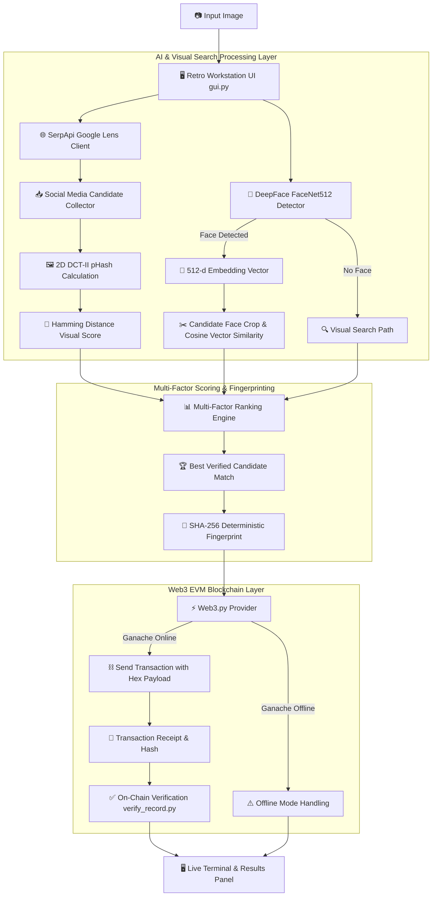

<div align="center">

```text
╔═════════════════════════════════════════════════════════════════════════════════╗
║  ██████╗ ██████╗  ██████╗███████╗███████╗███████╗██████╗  ██████╗██╗  ██╗       ║
║  ██╔════╝██╔══██╗██╔════╝██╔════╝██╔════╝██╔════╝██╔══██╗██╔════╝██║  ██║       ║
║  █████╗  ██████╔╝██║     █████╗  ███████╗█████╗  ██████╔╝██║     ███████║       ║
║  ██╔══╝  ██╔══██╗██║     ██╔══╝  ╚════██║██╔══╝  ██╔══██╗██║     ██╔══██║       ║
║  ██║     ██║  ██║╚██████╗███████╗███████║███████╗██║  ██║╚██████╗██║  ██║       ║
║  ╚═╝     ╚═╝  ╚═╝ ╚═════╝╚══════╝╚══════╝╚══════╝╚═╝  ╚═╝ ╚═════╝╚═╝  ╚═╝       ║
╠═════════════════════════════════════════════════════════════════════════════════╣
║  SYSTEM INITIALIZING...                                                         ║
║  > loading facenet512_biometrics.........................................[ OK ] ║
║  > connecting serpapi_google_lens........................................[ OK ] ║
║  > initializing 2d_dct_phash_matrix......................................[ OK ] ║
║  > establishing web3_evm_ganache_rpc.....................................[ OK ] ║
║                                                                                 ║
║  SYSTEM STATUS: ONLINE  |  WORKSTATION READY  |  HH GOA HACKATHON 2026          ║
╚═════════════════════════════════════════════════════════════════════════════════╝
```

> **`> FACESEARCH.EXE --mode=visual-intelligence --verify=on-chain`**
> 
> **Visual Intelligence Workstation & Immutable Blockchain Verification System**
>
> *Find online image origins, verify facial biometrics, and anchor tamper-proof search records onto the EVM blockchain.*

<br />

`[ 🌐 LIVE DEMO ]` &nbsp;•&nbsp; `[ 📹 DEMO VIDEO ]` &nbsp;•&nbsp; `[ 📄 DOCUMENTATION ]` &nbsp;•&nbsp; `[ 📊 SLIDE DECK ]` &nbsp;•&nbsp; `[ 💻 GITHUB REPO ]`

<br />


</div>

---

## 🟢 SYSTEM STATUS PANEL

```text
┌── SYSTEM TELEMETRY ─────────────────────────────────────────────────────────────┐
│ WORKSTATION STATUS : ONLINE                                                     │
│ SYSTEM KERNEL      : FACESEARCH.EXE v1.0.0 (HH GOA BUILD)                       │
│ AI EMBEDDING CORE  : DeepFace / FaceNet512 (512-Dimensional Vector Space)       │
│ REVERSE SEARCH API : Google Lens via SerpApi (Multi-Platform Social Indexing)   │
│ PERCEPTUAL HASH    : Custom 2D DCT-II Matrix Algorithm (64-Bit pHash)           │
│ BLOCKCHAIN LEDGER  : Web3.py / Ganache EVM RPC (Local Node http://127.0.0.1:8545) │
│ INTERFACE ENGINE   : Retro Cyberpunk Tkinter GUI (Thread-Safe Log Stream)       │
└─────────────────────────────────────────────────────────────────────────────────┘
```

---

## ⚡ JUDGE MODE: 60-SECOND QUICK TOUR

```text
╔═════════════════════════════════════════════════════════════════════════════════╗
║                   ⚡ JUDGE MODE: 60-SECOND FAST EVALUATION                       ║
╠═════════════════════════════════════════════════════════════════════════════════╣
║ [00:00 - 00:15]  LAUNCH WORKSTATION  ➔ Run 'python gui.py' to boot retro UI     ║
║ [00:15 - 00:30]  BIOMETRICS & LENS   ➔ Select image & run DeepFace + Google Lens ║
║ [00:30 - 00:45]  pHASH & RANKING     ➔ Inspect 2D DCT pHash + cosine face scores║
║ [00:45 - 01:00]  EVM PROVENANCE      ➔ Verify SHA-256 payload stored in EVM tx  ║
╚═════════════════════════════════════════════════════════════════════════════════╝
```

| Frame | Action | Terminal Command / Panel | System Output |
| :---: | :--- | :--- | :--- |
| `00:15` | **Boot Terminal** | `python gui.py` | Launches Sci-Fi Cyberpunk visual workstation & live stream terminal. |
| `00:30` | **Scan Image** | `Input Panel -> Select Image` | Runs 512-d FaceNet biometrics & queries Google Lens across social platforms. |
| `00:45` | **Multi-Factor Rank** | `Results Panel` | Computes 2D DCT pHash Hamming distance & ranks candidates. |
| `01:00` | **On-Chain Audit** | `Blockchain Panel` | Writes SHA-256 payload to EVM `tx["input"]` & verifies on-chain data. |

---

## 🚨 SYSTEM ERROR: CURRENT APPROACH FAILED

```text
> CRITICAL ALERT: VISUAL IDENTITY PROVENANCE FAILURE DETECTED

┌── CURRENT SITUATION ──────────────────┐  ┌── THE PROVENANCE GAP ─────────────────┐
│ Images are copied, cropped, and       │  │ Standard reverse searches fail to     │
│ shared across social networks         │  │ confirm facial biometrics, and offer  │
│ without origin tracking.              │  │ zero cryptographic proof of match.     │
└───────────────────────────────────────┘  └───────────────────────────────────────┘
                                   │
                                   ▼
┌── SYSTEM SOLUTION ───────────────────────────────────────────────────────────────┐
│ FACESEARCH.EXE automatically executes 512-d face matching, 2D DCT perceptual    │
│ hashing, and anchors timestamped SHA-256 fingerprints onto EVM transactions.     │
└──────────────────────────────────────────────────────────────────────────────────┘
```

<br />

```text
╭── PROTOCOL INSIGHT ─────────────────────────────────────────────────────────────╮
│                                                                                 │
│   "Combining deep neural face vectors (FaceNet512) with multi-platform          │
│    Google Lens search and 2D DCT perceptual hashing enables automated           │
│    identity discovery—while Web3 EVM block transactions anchor immutable        │
│    proof of origin without leaking raw biometric vectors on-chain."             │
│                                                                                 │
╰─────────────────────────────────────────────────────────────────────────────────╯
```

---

## 🎬 VISUAL OUTPUT: SEE IT IN ACTION

```text
[ SCREEN_01: INPUT ] ➔ [ SCREEN_02: PROCESS ] ➔ [ SCREEN_03: RANK ] ➔ [ SCREEN_04: ANCHOR ]
```

<table>
<tr>
<td width="50%">

```text
┌─ [ SCREEN_01 ] WORKSTATION BOOT ───────────────────┐
│ Load JPG/PNG/WebP into Retro Workstation GUI.     │
│ Displays image dimensions and system connectivity. │
└────────────────────────────────────────────────────┘
```

```text
[ Add Screenshot: gui.py Input Panel & Image Preview ]
```

</td>
<td width="50%">

```text
┌─ [ SCREEN_02 ] BIOMETRICS & LENS ──────────────────┐
│ DeepFace extracts 512-d FaceNet embedding vectors │
│ while SerpApi queries Google Lens across web nodes. │
└────────────────────────────────────────────────────┘
```

```text
[ Add Screenshot: gui.py Live Terminal Stream Log ]
```

</td>
</tr>
<tr>
<td width="50%">

```text
┌─ [ SCREEN_03 ] MULTI-FACTOR RANKING ───────────────┐
│ Downloads candidate thumbnails, computes 2D DCT    │
│ pHash distance, crops faces, and ranks candidates. │
└────────────────────────────────────────────────────┘
```

```text
[ Add Screenshot: gui.py Top Match Results Card ]
```

</td>
<td width="50%">

```text
┌─ [ SCREEN_04 ] BLOCKCHAIN ANCHOR ──────────────────┐
│ Writes deterministic SHA-256 hash to EVM payload   │
│ data and verifies transaction input on-chain.      │
└────────────────────────────────────────────────────┘
```

```text
[ Add Screenshot: gui.py Blockchain Verification Panel ]
```

</td>
</tr>
</table>

---

## ✨ MODULE GRID: KEY SYSTEM FEATURES

```text
╔═════════════════════════════════════════╦═════════════════════════════════════════╗
║ MODULE_01: BIOMETRIC ENGINE             ║ MODULE_02: LENS INTELLIGENCE            ║
╠═════════════════════════════════════════╬═════════════════════════════════════════╣
║ 👤 DeepFace & FaceNet512 Model          ║ 🌐 Multi-Platform Google Lens           ║
║ • 512-dimensional vector embedding      ║ • Queries Google Lens via SerpApi       ║
║ • OpenCV detector & facial alignment    ║ • Indexes IG, TikTok, Reddit, X, Web    ║
║ • Cosine similarity (~0.45 threshold)   ║ • Candidate thumbnail auto-downloader   ║
║ • Fallback to general visual search     ║ • Error & HTML content filter           ║
╠═════════════════════════════════════════╬═════════════════════════════════════════╣
║ MODULE_03: PERCEPTUAL HASH (pHASH)      ║ MODULE_04: MULTI-FACTOR RANKING         ║
╠═════════════════════════════════════════╬═════════════════════════════════════════╣
║ 🔬 2D DCT-II Matrix Algorithm           ║ 📊 Multi-Signal Scoring Engine          ║
║ • Custom 2D Discrete Cosine Transform   ║ • Combines Lens rank + pHash distance   ║
║ • 64-bit low-frequency coefficient hash ║ • Integrates FaceNet biometrics         ║
║ • Hamming distance visual metric        ║ • RapidFuzz title text similarity       ║
║ • Verifies crops, edits, and re-shares  ║ • Prioritizes verified image links      ║
╠═════════════════════════════════════════╬═════════════════════════════════════════╣
║ MODULE_05: BLOCKCHAIN PROVENANCE        ║ MODULE_06: CYBERPUNK WORKSTATION GUI    ║
╠═════════════════════════════════════════╬═════════════════════════════════════════╣
║ ⛓️ EVM On-Chain Transaction Logging     ║ 🖥️ Retro Console Interface (gui.py)     ║
║ • Writes SHA-256 hash to tx["input"]    ║ • Red/Cyan sci-fi terminal styling      ║
║ • SHA-256 format: Platform|Title|URL    ║ • Thread-safe live log redirector       ║
║ • Web3.py transaction verification      ║ • Asynchronous queue-driven execution   ║
║ • Ganache node offline fallback status  ║ • Live status indicators & metrics      ║
╚═════════════════════════════════════════╩═════════════════════════════════════════╝
```

---

## 🧠 SYSTEM ARCHITECTURE



<br />

### COMPONENT MAPPING TABLE

| Module File | Core Technology | System Role & Functionality |
| :--- | :--- | :--- |
| [`gui.py`](file:///c:/Users/devab/Documents/Face_search_blockchain/gui.py) | Tkinter, Pillow, Threading, Queue | Primary Retro Cyberpunk UI, live terminal log redirector, status monitoring. |
| [`blockchain/main.py`](file:///c:/Users/devab/Documents/Face_search_blockchain/blockchain/main.py) | Python 3.10+, CLI, Tkinter | End-to-end pipeline orchestrator (supports CLI and secondary desktop GUI). |
| [`reverse_search/face_id/face_id.py`](file:///c:/Users/devab/Documents/Face_search_blockchain/reverse_search/face_id/face_id.py) | DeepFace, FaceNet512, OpenCV | Face detection, 512-d vector extraction, cosine similarity distance. |
| [`reverse_search/search.py`](file:///c:/Users/devab/Documents/Face_search_blockchain/reverse_search/search.py) | SerpApi, NumPy, RapidFuzz | Google Lens API search, 2D DCT-II pHash, multi-factor candidate scoring. |
| [`blockchain/write_record.py`](file:///c:/Users/devab/Documents/Face_search_blockchain/blockchain/write_record.py) | Web3.py, Ganache EVM RPC | Connects to RPC, sends 0-value transaction with SHA-256 data in `tx["input"]`. |
| [`blockchain/verify_record.py`](file:///c:/Users/devab/Documents/Face_search_blockchain/blockchain/verify_record.py) | Web3.py | Reads transaction from EVM block and verifies stored input data against hash. |

---

## 🔬 TECHNICAL DEEP DIVE

```text
> ACCESSING CORE SYSTEM MATHEMATICS...
```

### 1. 2D Discrete Cosine Transform (DCT-II) pHash
Custom 2D DCT-II implementation converts $32 \times 32$ grayscale image matrices into frequency space:
$$B_{k_1, k_2} = \sum_{n_1=0}^{N-1} \sum_{n_2=0}^{N-1} X_{n_1, n_2} \cos\left[\frac{\pi}{N}\left(n_1+\frac{1}{2}\right)k_1\right] \cos\left[\frac{\pi}{N}\left(n_2+\frac{1}{2}\right)k_2\right]$$
The top-left $8 \times 8$ low-frequency coefficients generate a 64-bit binary hash. Hamming distance between hashes determines visual similarity.

### 2. FaceNet512 Biometric Cosine Metric
Facial vectors $\vec{u}, \vec{v} \in \mathbb{R}^{512}$ are evaluated via cosine distance:
$$d_{\text{cosine}}(\vec{u}, \vec{v}) = 1.0 - \frac{\vec{u} \cdot \vec{v}}{\|\vec{u}\|_2 \|\vec{v}\|_2}$$
Distance is scaled relative to FaceNet's $0.45$ decision threshold to produce a 0-100% biometric confidence score.

### 3. EVM Transaction Data Payload Storage
Instead of deploying smart contract bytecode, fingerprint hashes are written directly to standard transaction data payload fields:
```python
transaction = {
    "from": account,
    "to": account,
    "value": 0,
    "data": web3.to_bytes(text=fingerprint),  # SHA-256 payload stored on-chain
    "gas": 100000,
}
```

---

## 🛠️ TECHNOLOGY MATRIX

```text
┌─────────────────┬──────────────────────────────────────────────────────────────┐
│ LAYER           │ IMPLEMENTED TECHNOLOGIES                                     │
├─────────────────┼──────────────────────────────────────────────────────────────┤
│ LANGUAGE        │ Python 3.10+                                                 │
│ AI / BIOMETRICS │ DeepFace (v0.0.100), FaceNet512, TensorFlow, OpenCV, NumPy   │
│ SEARCH API      │ SerpApi (Google Lens Engine), Requests                       │
│ SIGNAL / MATH   │ Custom 2D DCT-II pHash, ImageHash, RapidFuzz                 │
│ BLOCKCHAIN      │ Web3.py (v8.0.0), Ganache EVM RPC, SHA-256 (hashlib)          │
│ WORKSTATION UI  │ Tkinter, Pillow, Threading, Queue, python-dotenv             │
└─────────────────┴──────────────────────────────────────────────────────────────┘
```

---

## 📈 SYSTEM IMPACT & ROADMAP

```text
v1.0  ██████████████████████████████████  CURRENT MVP (HH GOA IMPLEMENTED)
      ├─ DeepFace FaceNet512 512-d facial embedding extraction
      ├─ SerpApi Google Lens multi-platform discovery
      ├─ Custom 2D DCT-II perceptual hashing & Hamming distance
      ├─ Multi-factor candidate scoring engine
      ├─ Web3 EVM transaction logging & on-chain verification
      └─ Retro Cyberpunk visual workstation GUI (gui.py)
      │
      ▼
v1.1  ░░░░░░░░░░░░░░░░░░░░░░░░░░░░░░░░░░  FUTURE ENHANCEMENTS (PLANNED)
      ├─ Multi-face detection per image frame
      ├─ Public EVM testnet deployment (Sepolia / Polygon) with wallet signing
      └─ IPFS report payload archiving
```

---

## 🏆 SYSTEM CREDITS & TEAM

```text
╔═════════════════════════════════════════════════════════════════════════════════╗
║                                 SYSTEM CREDITS                                  ║
╠═════════════════════════════════╦═══════════════════════════════════════════════╣
║ MEMBER                          ║ ROLE & SYSTEM CONTRIBUTION                    ║
╠═════════════════════════════════╬═══════════════════════════════════════════════╣
║ Surya Nandan                    ║ Core AI, Web3 & Workstation Developer         ║
║                                 ║ (Implemented FaceNet, Lens, pHash & GUI)      ║
╠═════════════════════════════════╬═══════════════════════════════════════════════╣
║ Team Member                     ║ Contributor / Hackathon Teammate              ║
║                                 ║ [Add Role / Contribution]                     ║
╚═════════════════════════════════╩═══════════════════════════════════════════════╝
```

---

<details>
<summary><b>🔧 SYSTEM INSTALLATION & BOOTSTRAP COMMANDS (Click to expand)</b></summary>

<br />

### 1. Repository Clone
```bash
$ git clone https://github.com/SuryaNandan07/Face_search_blockchain.git
$ cd Face_search_blockchain
```

### 2. Environment Setup
```bash
$ python -m venv .venv
# Windows PowerShell:
$ .\.venv\Scripts\Activate.ps1
# Linux / macOS:
$ source .venv/bin/activate

$ pip install -r requirements.txt
```

### 3. Environment Configuration (`.env`)
Create `.env` file in project root:
```env
SERPAPI_KEY=your_serpapi_key_here
RPC_URL=http://127.0.0.1:8545
```

### 4. Executing Workstation
* **Primary Retro Cyberpunk GUI:**
  ```bash
  $ python gui.py
  ```
* **Secondary Desktop GUI:**
  ```bash
  $ python blockchain/main.py
  ```
* **CLI Execution Mode:**
  ```bash
  $ python blockchain/main.py path/to/image.jpg
  ```

### 5. File Directory Structure
```text
Face_search_blockchain/
├── .env                    # System environment config (SERPAPI_KEY, RPC_URL)
├── gui.py                  # Primary Retro Cyberpunk Visual Workstation GUI
├── requirements.txt        # Package dependencies
├── README.md               # Visual terminal documentation
├── blockchain/
│   ├── main.py             # Pipeline orchestrator (CLI & secondary GUI)
│   ├── write_record.py     # Web3 EVM transaction writer module
│   └── verify_record.py    # Web3 EVM transaction verification module
└── reverse_search/
    ├── compare_images.py   # Perceptual hash candidate helper
    ├── search.py           # Google Lens, 2D DCT pHash & scoring engine
    └── face_id/
        └── face_id.py      # DeepFace FaceNet512 detection & cosine matching
```

</details>

---

<div align="center">

```text
╔═════════════════════════════════════════════════════════════════════════════════╗
║  BUILT TO SOLVE REAL-WORLD VISUAL MISUSE. DESIGNED TO SCALE BEYOND HACKATHONS.  ║
╚═════════════════════════════════════════════════════════════════════════════════╝
```

`[ LIVE DEMO ]` &nbsp;•&nbsp; `[ DEMO VIDEO ]` &nbsp;•&nbsp; `[ DOCUMENTATION ]` &nbsp;•&nbsp; `[ SLIDE DECK ]` &nbsp;•&nbsp; `[ GITHUB REPO ]`

</div>