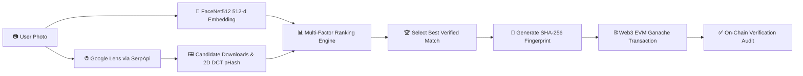

<div align="center">

`> SYSTEM ONLINE`

# 🚀 FACESEARCH.EXE

### **Visual Intelligence Workstation & Immutable Blockchain Verification System**

FACESEARCH.EXE locates online image origins across social platforms using DeepFace biometrics and Google Lens intelligence, anchoring tamper-proof search fingerprints onto an EVM blockchain.

<br />

[ **🌐 Live Demo** ] · [ **📹 Demo Video** ] · [ **📄 Documentation** ] · [ **📊 Slide Deck** ] · [ **💻 GitHub Repo** ]

<br />


</div>

---

## ⚡ QUICK GLANCE

| 🎯 PROBLEM | 💡 SOLUTION | ⚙️ TECH STACK | ⛓️ VERIFICATION |
| :--- | :--- | :--- | :--- |
| Stolen photos and identity misuse lack verifiable online origin proof. | Automated reverse Lens search + 512-d facial biometrics + EVM transaction logging. | DeepFace (FaceNet512), SerpApi, 2D DCT pHash, Web3.py, Ganache, Tkinter GUI. | Deterministic SHA-256 fingerprint (`Platform\|Title\|URL\|Category`) written to EVM `tx["input"]`. |

---

## 👤 USER JOURNEY

```text
USER (Photo Upload) ➔ DEEPFACE & LENS SEARCH ➔ pHASH & VECTOR RANKING ➔ BLOCKCHAIN ANCHOR ➔ VERIFIED RECORD
```

* **Input**: User selects a photo (`.jpg`, `.png`, `.webp`) via the Cyberpunk desktop GUI (`gui.py`) or CLI.
* **Processing**: System extracts 512-d FaceNet biometrics, queries Google Lens API, downloads candidate thumbnails, and computes 2D DCT pHash Hamming distance.
* **Output**: Ranks the top verified match with confidence metrics and anchors a SHA-256 fingerprint onto local Ganache EVM.

---

## ⚙️ PIPELINE / HOW IT WORKS



1. **Biometric & Lens Scan**: Extracts 512-d FaceNet vectors while querying Google Lens across social platforms.
2. **Visual Verification**: Downloads candidate thumbnails, computes 64-bit 2D DCT pHash distance, and crops faces for vector cosine matching.
3. **Multi-Factor Ranking**: Ranks candidates by weighting Lens match category, pHash visual distance, face similarity, and title text matching.
4. **On-Chain Audit**: Hashes metadata into SHA-256, writes it to EVM `tx["input"]`, and verifies transaction data integrity on-chain.

---

## ✨ FEATURES

<table>
<tr>
<td width="50%">

### 👤 FaceNet512 Biometrics
Extracts 512-dimensional facial embeddings using DeepFace with OpenCV detector backend and calibrated cosine similarity (~0.45 threshold).

</td>
<td width="50%">

### 🌐 Multi-Platform Google Lens
Queries Google Lens via SerpApi to discover exact, visual, and organic origins across Instagram, TikTok, Reddit, X (Twitter), YouTube, and web nodes.

</td>
</tr>
<tr>
<td width="50%">

### 🔬 2D DCT-II Perceptual Hash
Computes 64-bit low-frequency DCT perceptual hashes (pHash) and measures Hamming distance to verify cropped or re-shared candidate images.

</td>
<td width="50%">

### 📊 Multi-Factor Ranking Engine
Weighted scoring engine combining Google Lens match rank, pHash visual similarity, facial biometrics, and RapidFuzz text similarity.

</td>
</tr>
<tr>
<td width="50%">

### ⛓️ EVM On-Chain Provenance
Web3.py provider writes deterministic SHA-256 hashes (`Platform|Title|URL|Category`) directly into EVM `tx["input"]` and verifies stored payload data.

</td>
<td width="50%">

### 🖥️ Retro Workstation GUI
Sci-Fi terminal desktop interface (`gui.py`) featuring thread-safe live stdout/stderr stream redirection and asynchronous queue execution.

</td>
</tr>
</table>

---

## 🎬 SEE IT IN ACTION

```text
[ 01 INPUT ] ➔ [ 02 PROCESSING ] ➔ [ 03 RANKING ] ➔ [ 04 BLOCKCHAIN ]
```

<table>
<tr>
<td width="50%">

### 01 — Workstation & Image Input
Select input photo (`.jpg`, `.png`, `.webp`) in the retro desktop GUI (`gui.py`). The system validates resolution and initializes services.

```text
[ Add Screenshot: gui.py Input Panel & Image Preview ]
```

</td>
<td width="50%">

### 02 — Biometric & Lens Processing
DeepFace detects faces and generates 512-d embeddings while SerpApi queries Google Lens across social networks in real time.

```text
[ Add Screenshot: gui.py Live Stream Terminal Log ]
```

</td>
</tr>
<tr>
<td width="50%">

### 03 — Multi-Factor Match Ranking
Candidate thumbnails are fetched and scored via 2D DCT pHash and face vector cosine distance, displaying the top verified result card.

```text
[ Add Screenshot: gui.py Top Match Results Card ]
```

</td>
<td width="50%">

### 04 — EVM On-Chain Anchoring
Generates a deterministic SHA-256 fingerprint hash and commits it directly to Ganache EVM transaction payload data with verification status.

```text
[ Add Screenshot: gui.py Blockchain Verification Panel ]
```

</td>
</tr>
</table>

---

## 🛠️ TECH STACK

| Layer | Stack |
| :--- | :--- |
| **Language & Core** | Python 3.10+, `python-dotenv` |
| **AI / ML & Biometrics** | DeepFace (`0.0.100`), FaceNet512, TensorFlow (`2.21.0`), OpenCV, NumPy |
| **Search & Perceptual Hashing** | SerpApi (`1.1.0`), Custom 2D DCT-II pHash, ImageHash (`4.3.2`), RapidFuzz |
| **Blockchain / Web3** | Web3.py (`8.0.0`), Ganache EVM RPC (`http://127.0.0.1:8545`), `hashlib` (SHA-256) |
| **Interface** | Tkinter GUI, Pillow (`12.3.0`), Threading, Queue |

---

## 📋 REQUIREMENTS / PREREQUISITES

* **Python 3.10+**
* **SerpApi Key** (for Google Lens search)
* **Ganache** local EVM RPC node (`http://127.0.0.1:8545`)
* **Git**

---

## 🚀 INSTALLATION

```bash
git clone https://github.com/SuryaNandan07/Face_search_blockchain.git
cd Face_search_blockchain

python -m venv .venv
# Windows: .\.venv\Scripts\Activate.ps1 | Linux/macOS: source .venv/bin/activate

pip install -r requirements.txt
```

---

## 🔐 ENVIRONMENT VARIABLES

Create `.env` in the root directory:

```env
SERPAPI_KEY=your_serpapi_key_here
RPC_URL=http://127.0.0.1:8545
```

| Variable | Purpose |
| :--- | :--- |
| `SERPAPI_KEY` | Authentication key for SerpApi to perform Google Lens reverse image queries. |
| `RPC_URL` | EVM JSON-RPC provider URL (defaults to Ganache at `http://127.0.0.1:8545`). |

---

## ⛓️ HOW TO START GANACHE

`> STARTING BLOCKCHAIN NETWORK`

```bash
# Option 1: Start Ganache CLI on standard RPC port 8545
ganache-cli -p 8545

# Option 2: Start Ganache GUI and configure RPC server to http://127.0.0.1:8545
```

* **RPC Endpoint**: `http://127.0.0.1:8545`
* **Account**: Connects via Web3.py using default account `web3.eth.accounts[0]`.
* **Offline Fallback**: Automatically logs notice and skips on-chain writing if Ganache is offline.

---

## ▶️ HOW TO START THE APPLICATION

`> START APPLICATION`

```bash
# Launch Primary Retro Visual Workstation GUI
python gui.py

# Launch Secondary Desktop GUI
python blockchain/main.py

# Launch CLI Pipeline Mode
python blockchain/main.py path/to/image.jpg
```

---

## ⛓️ HOW BLOCKCHAIN VERIFICATION WORKS

```text
METADATA ➔ SHA-256 HASH ➔ EVM TRANSACTION (tx["input"]) ➔ BLOCK RECEIPT ➔ AUDIT VERIFY
```

1. **Fingerprint Hash**: Formats top candidate metadata (`Platform|Title|URL|Category`) into a SHA-256 hex string.
2. **On-Chain Write**: `write_fingerprint()` builds a zero-value transaction with `data = web3.to_bytes(text=fingerprint)` sent from `web3.eth.accounts[0]`.
3. **Block Confirmation**: Broadcasts transaction to Ganache EVM, returning a 66-character transaction hash.
4. **On-Chain Audit**: `verify_fingerprint()` queries `web3.eth.get_transaction(tx_hash)` to read `tx["input"]` and verify hash equality.

---

## 📁 PROJECT STRUCTURE

```text
Face_search_blockchain/
├── .env                    # Environment variables (SERPAPI_KEY, RPC_URL)
├── gui.py                  # Primary Retro Cyberpunk Visual Workstation GUI
├── requirements.txt        # Package dependencies
├── README.md               # Visual project documentation
├── blockchain/
│   ├── main.py             # Pipeline orchestrator (CLI & secondary GUI)
│   ├── write_record.py     # Web3 EVM transaction writer module
│   └── verify_record.py    # Web3 EVM transaction verifier module
└── reverse_search/
    ├── compare_images.py   # Perceptual hash candidate helper
    ├── search.py           # Google Lens, 2D DCT pHash & scoring engine
    └── face_id/
        └── face_id.py      # DeepFace FaceNet512 detection & cosine matching
```

---

## ✅ EXPECTED OUTPUT

```text
✓ Image loaded and 512-d FaceNet embedding extracted
✓ Google Lens results fetched across social web nodes
✓ Candidate thumbnails downloaded and 2D DCT pHash calculated
✓ Multi-factor ranking engine selects top verified match
✓ Deterministic SHA-256 fingerprint generated
✓ Transaction recorded on local Ganache EVM with Tx Hash (0x...)
✓ Blockchain verification confirms payload match on-chain
```

---

## ⚠️ KNOWN LIMITATIONS

* **Local EVM Node**: On-chain verification requires Ganache running locally (`http://127.0.0.1:8545`).
* **SerpApi Quota**: Google Lens reverse searches require an active `SERPAPI_KEY`.
* **Dominant Face Focus**: DeepFace processes the primary face detected in input frames.

---

## 🏆 HACKATHON / TASK INFORMATION

* **Hackathon**: HH Goa Hackathon 2026
* **Category**: AI + Web3 Visual Intelligence & Provenance
* **Objective**: Build an end-to-end operational workstation to find online image origins, verify facial biometrics, and anchor tamper-proof search records onto EVM transactions.