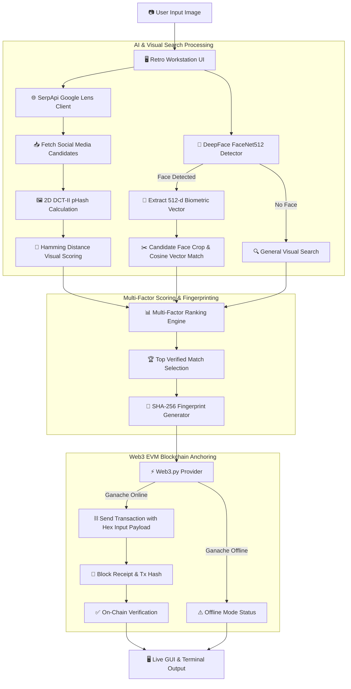

<div align="center">

# 🚀 FACESEARCH.EXE
### **Visual Intelligence Workstation & Immutable Blockchain Verification System**

*Find online image origins, verify facial biometrics, and anchor tamper-proof search records onto the EVM blockchain.*

<br />

[ **🌐 Live Demo** ] · [ **📹 Demo Video** ] · [ **📄 Documentation** ] · [ **📊 Slide Deck** ] · [ **💻 GitHub Repo** ]

<br />


</div>

---

## ⚡ Quick Glance

<table>
<tr>
<td width="25%" align="center">
<b>🎯 Problem</b><br><br>
Identity theft, deepfakes, and stolen photos lack cryptographic origin proof.
</td>
<td width="25%" align="center">
<b>💡 Solution</b><br><br>
Automated reverse lens search + 512-d facial matching + on-chain fingerprinting.
</td>
<td width="25%" align="center">
<b>⚙️ Built With</b><br><br>
DeepFace, SerpApi, 2D DCT pHash, Web3.py, Ganache, Tkinter GUI.
</td>
<td width="25%" align="center">
<b>🏆 Goal</b><br><br>
Tamper-proof visual provenance & forensic audit trail for online media.
</td>
</tr>
</table>

---

## ⚡ Judge's 60-Second Tour

| Time | What to Review | Location / Action | Hackathon Value |
| :---: | :--- | :--- | :--- |
| **00–15s** | **Visual Workstation UI** | Launch `python gui.py` | Retro Cyberpunk UI, live terminal log stream, image preview panel. |
| **15–30s** | **AI Facial Biometrics & Lens** | Select input photo & click Search | DeepFace (FaceNet512 512-d vector) + Google Lens multi-platform discovery. |
| **30–45s** | **pHash & Multi-Factor Scoring** | Check Top Candidate Card | 2D DCT-II pHash Hamming distance + cosine distance biometrics + RapidFuzz. |
| **45–60s** | **On-Chain EVM Verification** | View Blockchain Panel | SHA-256 payload stored in EVM `tx["input"]` & verified via Web3.py. |

---

## 🎯 The Problem

<table>
<tr>
<td width="33%" align="center">

### 😣 Today

Once photos are uploaded, cropped, or shared, tracing their original source across social networks requires manual cross-referencing.

</td>
<td width="33%" align="center">

### ⚠️ The Gap

Standard reverse searches don't confirm facial biometrics, nor do they generate verifiable, timestamped proof of when an image match was identified.

</td>
<td width="33%" align="center">

### 🎯 Our Solution

An automated pipeline that finds web origins, verifies 512-d face biometrics, and anchors an immutable SHA-256 record onto the EVM blockchain.

</td>
</tr>
</table>

<br />

> ### 💡 Core Insight
> **Combining deep neural face embeddings (FaceNet512) with multi-platform Google Lens intelligence and 2D DCT perceptual hashing enables automated identity tracking—while EVM blockchain transactions anchor immutable proof of discovery.**

---

## 🎬 See It In Action

```
[ 01 Input & Validation ] ➔ [ 02 Biometrics & Lens ] ➔ [ 03 Scoring & Ranking ] ➔ [ 04 On-Chain Anchor ]
```

<table>
<tr>
<td width="50%">

### 01 — Input Image & Workstation
Load any JPG, PNG, or WebP photo into the retro workstation UI (`gui.py`). The system validates dimensions and initializes background services.

```text
[ Add Screenshot: gui.py Input Panel & Preview Box ]
```

</td>
<td width="50%">

### 02 — Biometric & Lens Processing
DeepFace detects faces and extracts 512-d vectors while SerpApi queries Google Lens across Instagram, TikTok, Reddit, X, and the web.

```text
[ Add Screenshot: gui.py Live Redirector Terminal Stream ]
```

</td>
</tr>
<tr>
<td width="50%">

### 03 — Multi-Factor Match Ranking
Candidate thumbnails are fetched and processed via 2D DCT-II pHash and candidate face cropping. The top verified match is selected with confidence meters.

```text
[ Add Screenshot: gui.py Results Panel & Top Candidate Card ]
```

</td>
<td width="50%">

### 04 — EVM Blockchain Anchoring
A deterministic SHA-256 fingerprint hash (`Platform|Title|URL|Category`) is generated and written directly to Ganache EVM transaction payload data.

```text
[ Add Screenshot: gui.py Blockchain Verification Panel ]
```

</td>
</tr>
</table>

---

## ✨ Key Features

<table>
<tr>
<td width="50%">

### 👤 1. FaceNet512 Biometric Analysis
* **512-Dimensional Embeddings:** Uses DeepFace with `Facenet512` model and OpenCV detector backend.
* **Biometric Cosine Matching:** Calculates face similarity scores with calibrated ~0.45 distance thresholds.
* **Graceful Fallback:** Automatically switches to visual search if no face is present.

</td>
<td width="50%">

### 🌐 2. Google Lens Intelligence
* **Multi-Platform Web Discovery:** Queries Google Lens via SerpApi for exact, visual, and organic matches.
* **Social Domain Categorizer:** Identifies origins across Instagram, TikTok, Reddit, X (Twitter), YouTube, Pinterest, and LinkedIn.
* **Sanitized Image Retrieval:** Downloads candidate thumbnails with automated error & HTML filtering.

</td>
</tr>
<tr>
<td width="50%">

### 🔬 3. 2D DCT-II Perceptual Hashing
* **Custom DCT-II Matrix Math:** Calculates 64-bit perceptual hashes (pHash) using low-frequency DCT coefficients.
* **Hamming Distance Verification:** Quantifies visual image similarity to verify re-shares and crops.

</td>
<td width="50%">

### 📊 4. Multi-Factor Scoring Engine
* **Holistic Ranking:** Combines Google Lens rank, pHash Hamming distance, FaceNet biometrics, and RapidFuzz text matching.
* **Verified Match Prioritization:** Filters out unverified/unavailable links to pick the top verified source.

</td>
</tr>
<tr>
<td width="50%">

### ⛓️ 5. EVM Blockchain Provenance
* **On-Chain Payload Storage:** Writes deterministic SHA-256 hashes (`Platform|Title|URL|Category`) directly into EVM `tx["input"]`.
* **On-Chain Audit Verification:** Fetches block receipts and verifies stored transaction data against original hashes via Web3.py.
* **Offline Handling:** Built-in node status checks for seamless offline fallback.

</td>
<td width="50%">

### 🖥️ 6. Retro Cyberpunk Workstation GUI
* **Sci-Fi Terminal Aesthetic:** High-density Tkinter workstation (`gui.py`) with red/cyan styling.
* **Thread-Safe Log Stream:** Real-time stdout/stderr redirector with carriage return cleanup.
* **Asynchronous Pipeline:** Background execution queue ensures UI responsiveness.

</td>
</tr>
</table>

---

## 🧠 System Architecture & Workflow



<br />

### Technical Component Mapping

| Layer | Component File | Key Technology | Role & Purpose |
| :--- | :--- | :--- | :--- |
| **Desktop Workstation** | [`gui.py`](file:///c:/Users/devab/Documents/Face_search_blockchain/gui.py) | Python Tkinter, Pillow, Threading | Cyberpunk visual UI, live log stream, status bar, results cards. |
| **Orchestrator** | [`blockchain/main.py`](file:///c:/Users/devab/Documents/Face_search_blockchain/blockchain/main.py) | Python 3.10+, CLI parser | Executes end-to-end pipeline via CLI or secondary desktop GUI. |
| **AI Biometrics** | [`reverse_search/face_id/face_id.py`](file:///c:/Users/devab/Documents/Face_search_blockchain/reverse_search/face_id/face_id.py) | DeepFace, FaceNet512, OpenCV | Face detection, 512-d vector generation, cosine distance matching. |
| **Search Engine & pHash** | [`reverse_search/search.py`](file:///c:/Users/devab/Documents/Face_search_blockchain/reverse_search/search.py) | SerpApi, NumPy, RapidFuzz | Google Lens query, 2D DCT pHash, candidate scoring & fingerprinting. |
| **Blockchain Writer** | [`blockchain/write_record.py`](file:///c:/Users/devab/Documents/Face_search_blockchain/blockchain/write_record.py) | Web3.py, Ganache EVM RPC | Connects to RPC, constructs zero-value transaction with SHA-256 data. |
| **Blockchain Verifier** | [`blockchain/verify_record.py`](file:///c:/Users/devab/Documents/Face_search_blockchain/blockchain/verify_record.py) | Web3.py | Reads transaction back from EVM block and verifies stored payload. |

---

## 🔬 Technical Highlights

<table>
<tr>
<td width="50%">

### ⚙️ Signal Processing & pHash
Uses a dependency-free 2D Discrete Cosine Transform (DCT-II) over standard $32 \times 32$ grayscale matrices to extract top-left $8 \times 8$ low-frequency coefficients, outputting a robust 64-bit perceptual hash for Hamming distance scoring.

</td>
<td width="50%">

### 🧠 Facial Vector Cosine Similarity
Biometric scoring measures the normalized dot product of input and candidate 512-d FaceNet vectors:
$$\text{Sim}(\vec{u}, \vec{v}) = \frac{\vec{u} \cdot \vec{v}}{\|\vec{u}\| \|\vec{v}\|}$$
Cosine distance is scaled against FaceNet's $0.45$ decision boundary to compute match percentages.

</td>
</tr>
<tr>
<td width="50%">

### 🔐 Cryptographic Provenance
Fingerprints are created deterministically via SHA-256 over standardized metadata strings: `Platform|Title|URL|Category`, ensuring zero privacy leak of raw biometric vectors on-chain while providing audit proof.

</td>
<td width="50%">

### ⛓️ EVM Data Field Payload Storage
Instead of requiring complex smart contract deployments, fingerprints are written directly to transaction `input` bytes (`tx["input"]`) on EVM block transactions, minimizing gas usage while leveraging EVM immutability.

</td>
</tr>
</table>

---

## 🛠️ Visual Tech Stack

### AI / ML & Vision
`Python` `DeepFace` `FaceNet512` `TensorFlow` `tf_keras` `OpenCV` `NumPy` `Pillow`

### Search & Perceptual Hashing
`SerpApi (Google Lens API)` `2D DCT-II pHash` `ImageHash` `RapidFuzz` `Requests`

### Web3 & Blockchain
`Web3.py` `Ethereum EVM` `Ganache RPC` `SHA-256 (hashlib)`

### Interface & Runtime
`Tkinter GUI` `Threading & Queue` `python-dotenv`

---

## 🗺️ Roadmap

```text
✅ Current MVP (Implemented)
   ├─ DeepFace FaceNet512 512-d facial embedding extraction
   ├─ Google Lens multi-platform reverse search via SerpApi
   ├─ 2D DCT-II perceptual hashing & Hamming distance matching
   ├─ Multi-factor candidate scoring & ranking engine
   ├─ Web3 EVM transaction logging & on-chain verification (Ganache)
   └─ Retro Cyberpunk desktop workstation GUI with live log streaming
      ↓
🔜 Next Enhancements (Planned)
   ├─ Multi-face detection per image (tracking multiple subjects)
   ├─ Public EVM testnet deployment (Sepolia / Polygon) with wallet signing
   └─ IPFS payload pinning for off-chain report archiving
```

---

## 🏆 Why This Project Matters

> **Problem:** Stolen images and catfishing spread rapidly without clear origin proof or biometric validation.
>
> **Solution:** FACESEARCH.EXE unifies facial biometrics, Google Lens visual search, 2D DCT perceptual hashing, and EVM blockchain transaction logging into a single operational workstation.
>
> **Impact:** Provides content creators, forensic analysts, and everyday users with instant visual discovery and verifiable, tamper-proof on-chain proof of image matches.

---

## 👥 Team

<table>
<tr>
<td align="center" width="50%">

### 👤 Surya Nandan
**Core Developer & AI / Web3 Engineer**
*Implemented FaceNet512 biometrics, Google Lens search pipeline, pHash matrix engine, Web3 EVM verification, and Tkinter retro workstation.*

</td>
<td align="center" width="50%">

### 👤 Team Member
**Contributor / Hackathon Teammate**
*`[Add Role / Contribution]`*

</td>
</tr>
</table>

---

<details>
<summary><b>🔧 Developer Guide & Running the Application (Click to expand)</b></summary>

<br />

### 1. Prerequisites
* **Python 3.10+**
* *(Optional)* **Ganache** local RPC running at `http://127.0.0.1:8545`

### 2. Installation
```bash
# Clone the repository
git clone https://github.com/SuryaNandan07/Face_search_blockchain.git
cd Face_search_blockchain

# Create virtual environment
python -m venv .venv
# Windows: .\.venv\Scripts\Activate.ps1 | Linux/macOS: source .venv/bin/activate

# Install dependencies
pip install -r requirements.txt
```

### 3. Environment Variables (`.env`)
Create a `.env` file in the root folder:
```env
SERPAPI_KEY=your_serpapi_key_here
RPC_URL=http://127.0.0.1:8545
```

### 4. Running the Application
* **Primary Retro Cyberpunk GUI:**
  ```bash
  python gui.py
  ```
* **Secondary Desktop GUI:**
  ```bash
  python blockchain/main.py
  ```
* **CLI Execution Mode:**
  ```bash
  python blockchain/main.py path/to/image.jpg
  ```

### 5. Detailed Project Structure
```text
Face_search_blockchain/
├── .env                    # Environment variables (SERPAPI_KEY, RPC_URL)
├── gui.py                  # Primary Retro Cyberpunk Visual Workstation UI
├── requirements.txt        # Package dependencies
├── README.md               # Visual product documentation
├── blockchain/
│   ├── main.py             # Pipeline orchestrator (CLI & secondary GUI)
│   ├── write_record.py     # Web3 EVM transaction writer
│   └── verify_record.py    # Web3 EVM transaction verifier
└── reverse_search/
    ├── compare_images.py   # Perceptual hash candidate helper
    ├── search.py           # Google Lens, 2D DCT pHash & multi-factor scoring
    └── face_id/
        └── face_id.py      # DeepFace FaceNet512 detection & cosine matching
```

</details>

---

<div align="center">

### **Built to solve real-world visual identity misuse. Designed to scale beyond the hackathon.**

[ **Live Demo** ] · [ **Demo Video** ] · [ **Documentation** ] · [ **Slide Deck** ] · [ **GitHub Repo** ]

</div>